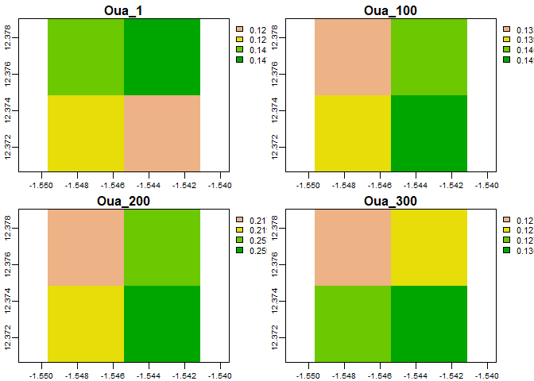
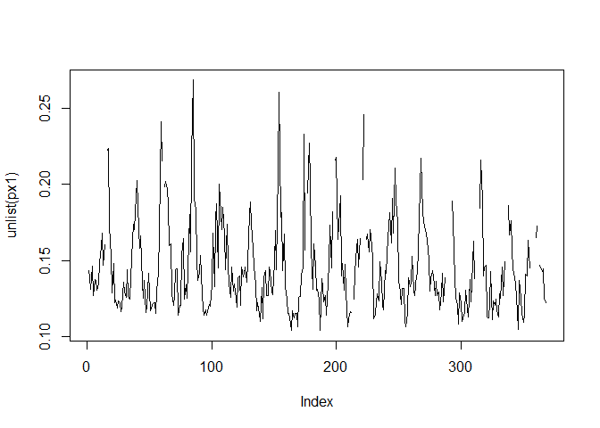
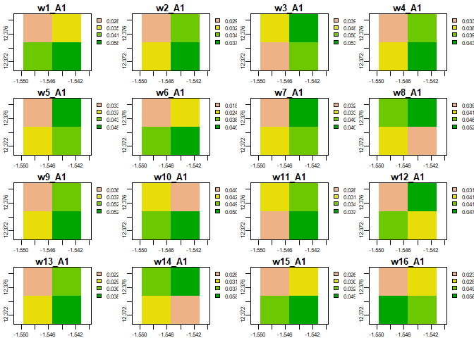

<!-- README.md is generated from README.Rmd. Please edit that file -->

# gecm

<!-- badges: start -->
<!-- badges: end -->

The `gecm` package contains functions for the analysis of change within
raster time-series data. The following methods are (or will be)
implemented:

1.  Harmonic Regression/Seasonal Trends Analysis: Change detection
    through analysis of reoccurring signals.
2.  Prohphet: Detection of spatially and/or temporally contiguous groups
    of anomalies
3.  Space beats time: Detection of short-term/abrupt change via
    comparison of spatial and temporal residuals

## Installation

You can install the development version from
[GitHub](https://github.com/) with:

``` r
# install.packages("devtools")
devtools::install_github("dahcase/gecm")
```

## Example

``` r
library(gecm)
library(terra)
#> terra version 1.0.10

#Load a simple raster time series
ouaga = system.file('extdata/ouaga.tif', package = 'gecm')
ouaga = rast(ouaga)

#plot a few layers
plot(subset(ouaga, c(1, 100, 200, 300)))
```



``` r
#plot the time series of a pixel
px1 = ouaga[1]
plot(unlist(px1), type = 'l')
```



``` r
#run the harmonic regression
res = harmonic(r = ouaga, 
               harmonic_value = 2, # num harmonics
               'all', #values to return
               window = 23 #determines window size.
                           #For this product, find the seasonality per year
               ) 

#plot the results for A1 for all windows. Where A1 is the peak seasonality.
A1s = grep('A1', names(res))

plot(subset(res, A1s))
```


